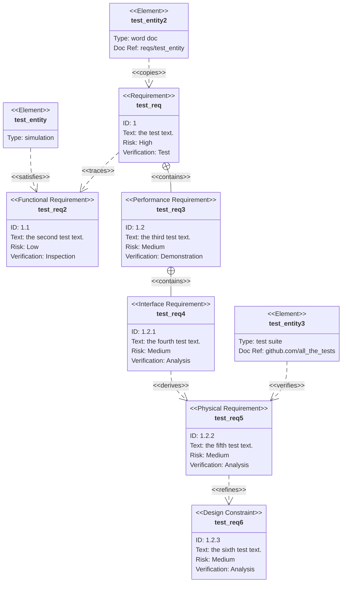
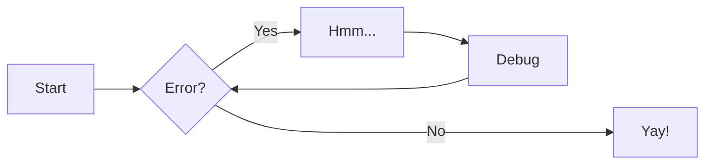
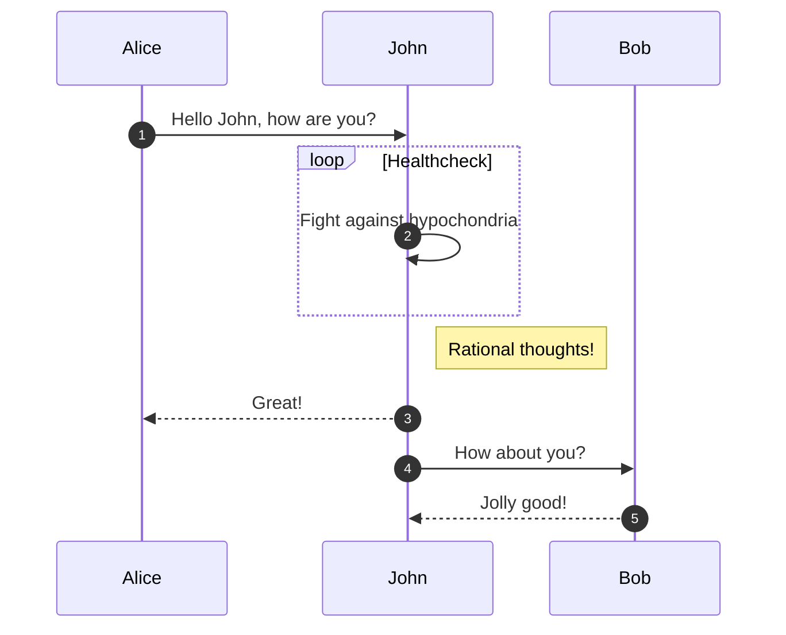
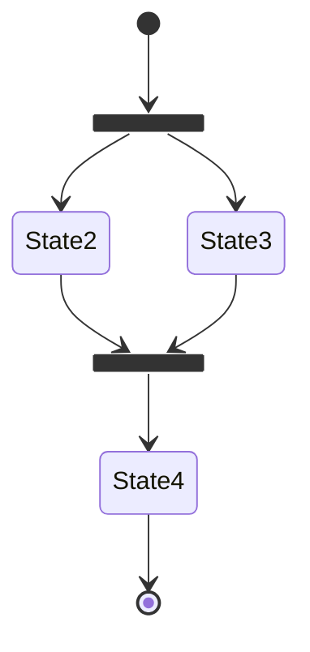
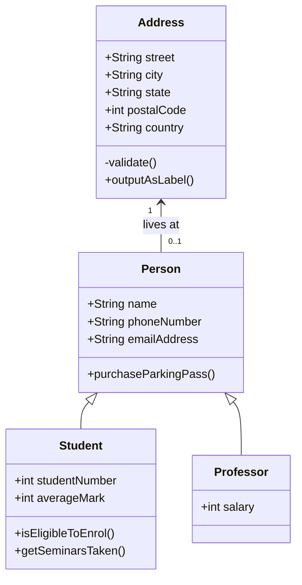
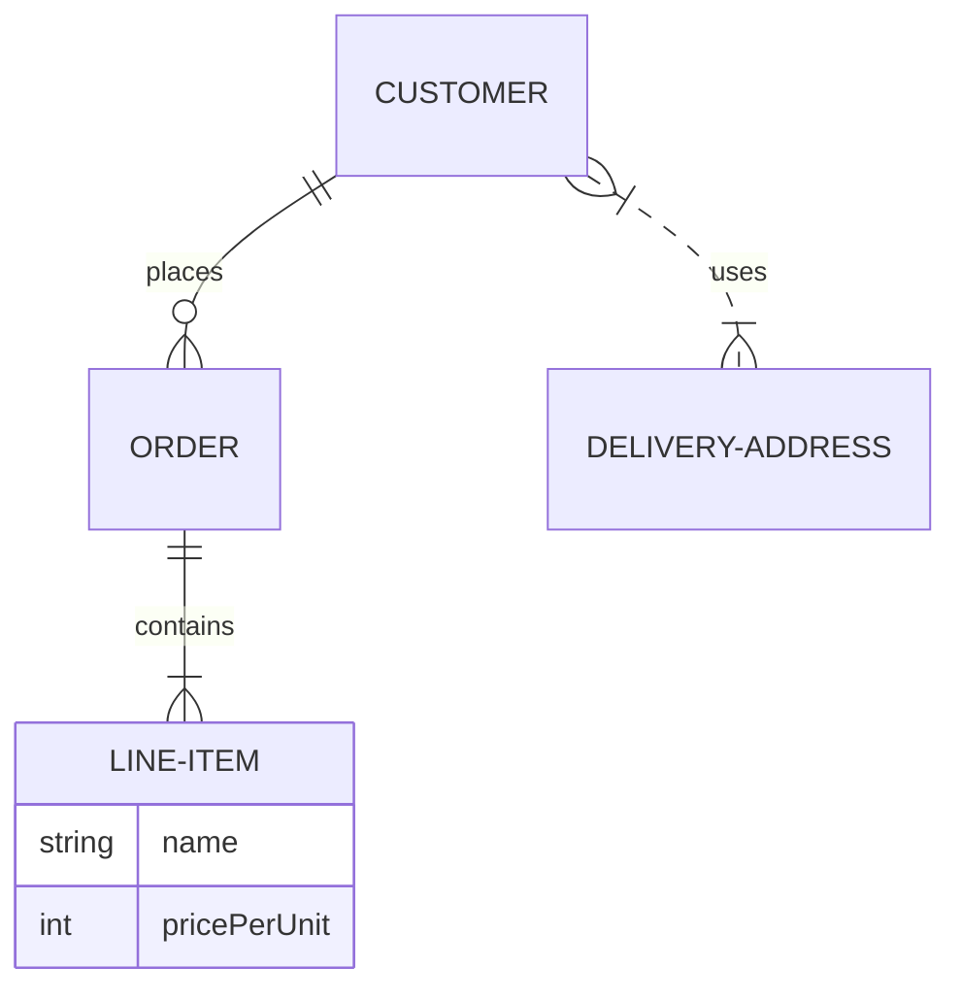
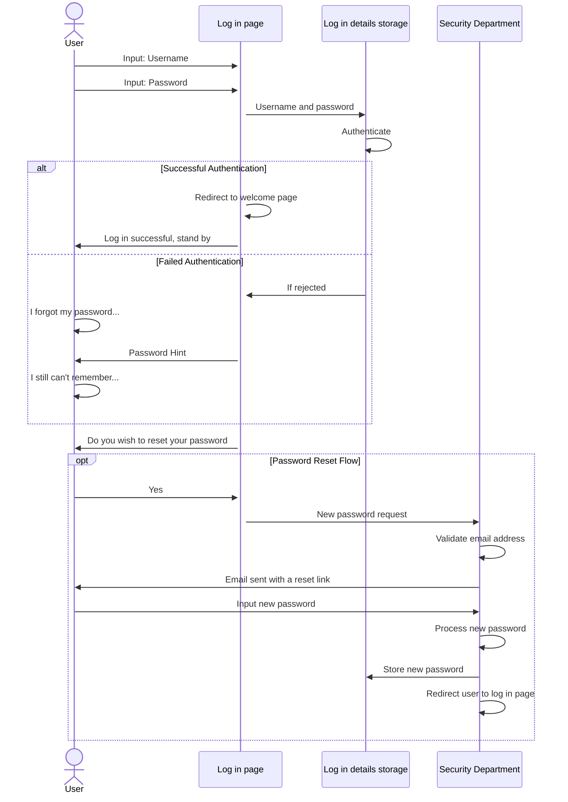
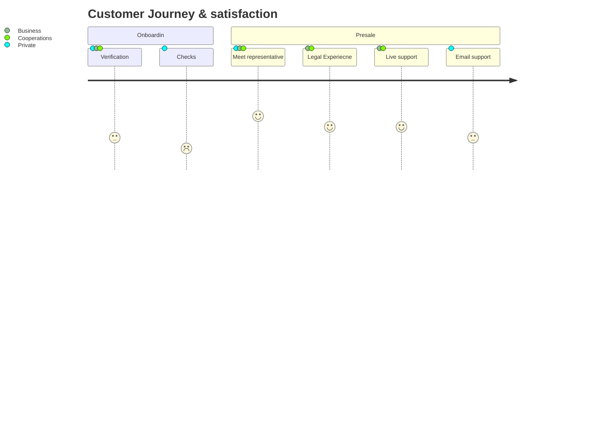

# Диаграммы



## Блок схема


## Диаграмма последовательностей


## Диаграмма состояний


## Диаграмма классов


## Диаграмма сущностей



## Тест единого источника
{!equations.md!}

## UML диаграммы


```kroki-blockdiag
blockdiag {
 blockdiag -> generates -> "block-diagrams";
 blockdiag -> is -> "very easy!";

 blockdiag [color = "greenyellow"];
 "block-diagrams" [color = "pink"];
 "very easy!" [color = "orange"];
}
```

```kroki-seqdiag
seqdiag {
  browser  -> webserver [label = "GET /index.html"];
  browser <-- webserver;
  browser  -> webserver [label = "POST /blog/comment"];
  webserver  -> database [label = "INSERT comment"];
  webserver <-- database;
  browser <-- webserver;
}
```
```kroki-nwdiag
nwdiag {
  network dmz {
    address = "210.x.x.x/24"

    web01 [address = "210.x.x.1"];
    web02 [address = "210.x.x.2"];
  }
  network internal {
    address = "172.x.x.x/24";

    web01 [address = "172.x.x.1"];
    web02 [address = "172.x.x.2"];
    db01;
    db02;
  }
}
```
```kroki-graphviz
digraph "unix" {
  graph [ fontname = "Helvetica-Oblique",
          fontsize = 36,
          label = "\n\n\n\nObject Oriented Graphs\nStephen North, 3/19/93",
          size = "6,6" ];
  node [ shape = polygon,
         sides = 4,
         distortion = "0.0",
         orientation = "0.0",
         skew = "0.0",
         color = white,
         style = filled,
         fontname = "Helvetica-Outline" ];
  "5th Edition" [sides=9, distortion="0.936354", orientation=28, skew="-0.126818", color=salmon2];
  "6th Edition" [sides=5, distortion="0.238792", orientation=11, skew="0.995935", color=deepskyblue];
  "PWB 1.0" [sides=8, distortion="0.019636", orientation=79, skew="-0.440424", color=goldenrod2];
  LSX [sides=9, distortion="-0.698271", orientation=22, skew="-0.195492", color=burlywood2];
  "1 BSD" [sides=7, distortion="0.265084", orientation=26, skew="0.403659", color=gold1];
  "Mini Unix" [distortion="0.039386", orientation=2, skew="-0.461120", color=greenyellow];
  Wollongong [sides=5, distortion="0.228564", orientation=63, skew="-0.062846", color=darkseagreen];
  Interdata [distortion="0.624013", orientation=56, skew="0.101396", color=dodgerblue1];
  "Unix/TS 3.0" [sides=8, distortion="0.731383", orientation=43, skew="-0.824612", color=thistle2];
  "PWB 2.0" [sides=6, distortion="0.592100", orientation=34, skew="-0.719269", color=darkolivegreen3];
  "7th Edition" [sides=10, distortion="0.298417", orientation=65, skew="0.310367", color=chocolate];
  "8th Edition" [distortion="-0.997093", orientation=50, skew="-0.061117", color=turquoise3];
  "32V" [sides=7, distortion="0.878516", orientation=19, skew="0.592905", color=steelblue3];
  V7M [sides=10, distortion="-0.960249", orientation=32, skew="0.460424", color=navy];
  "Ultrix-11" [sides=10, distortion="-0.633186", orientation=10, skew="0.333125", color=darkseagreen4];
  Xenix [sides=8, distortion="-0.337997", orientation=52, skew="-0.760726", color=coral];
  "UniPlus+" [sides=7, distortion="0.788483", orientation=39, skew="-0.526284", color=darkolivegreen3];
  "9th Edition" [sides=7, distortion="0.138690", orientation=55, skew="0.554049", color=coral3];
  "2 BSD" [sides=7, distortion="-0.010661", orientation=84, skew="0.179249", color=blanchedalmond];
  "2.8 BSD" [distortion="-0.239422", orientation=44, skew="0.053841", color=lightskyblue1];
  "2.9 BSD" [distortion="-0.843381", orientation=70, skew="-0.601395", color=aquamarine2];
  "3 BSD" [sides=10, distortion="0.251820", orientation=18, skew="-0.530618", color=lemonchiffon];
  "4 BSD" [sides=5, distortion="-0.772300", orientation=24, skew="-0.028475", color=darkorange1];
  "4.1 BSD" [distortion="-0.226170", orientation=38, skew="0.504053", color=lightyellow1];
  "4.2 BSD" [sides=10, distortion="-0.807349", orientation=50, skew="-0.908842", color=darkorchid4];
  "4.3 BSD" [sides=10, distortion="-0.030619", orientation=76, skew="0.985021", color=lemonchiffon2];
  "Ultrix-32" [distortion="-0.644209", orientation=21, skew="0.307836", color=goldenrod3];
  "PWB 1.2" [sides=7, distortion="0.640971", orientation=84, skew="-0.768455", color=cyan];
  "USG 1.0" [distortion="0.758942", orientation=42, skew="0.039886", color=blue];
  "CB Unix 1" [sides=9, distortion="-0.348692", orientation=42, skew="0.767058", color=firebrick];
  "USG 2.0" [distortion="0.748625", orientation=74, skew="-0.647656", color=chartreuse4];
  "CB Unix 2" [sides=10, distortion="0.851818", orientation=32, skew="-0.020120", color=greenyellow];
  "CB Unix 3" [sides=10, distortion="0.992237", orientation=29, skew="0.256102", color=bisque4];
  "Unix/TS++" [sides=6, distortion="0.545461", orientation=16, skew="0.313589", color=mistyrose2];
  "PDP-11 Sys V" [sides=9, distortion="-0.267769", orientation=40, skew="0.271226", color=cadetblue1];
  "USG 3.0" [distortion="-0.848455", orientation=44, skew="0.267152", color=bisque2];
  "Unix/TS 1.0" [distortion="0.305594", orientation=75, skew="0.070516", color=orangered];
  "TS 4.0" [sides=10, distortion="-0.641701", orientation=50, skew="-0.952502", color=crimson];
  "System V.0" [sides=9, distortion="0.021556", orientation=26, skew="-0.729938", color=darkorange1];
  "System V.2" [sides=6, distortion="0.985153", orientation=33, skew="-0.399752", color=darkolivegreen4];
  "System V.3" [sides=7, distortion="-0.687574", orientation=58, skew="-0.180116", color=lightsteelblue1];
  "5th Edition" -> "6th Edition";
  "5th Edition" -> "PWB 1.0";
  "6th Edition" -> LSX;
  "6th Edition" -> "1 BSD";
  "6th Edition" -> "Mini Unix";
  "6th Edition" -> Wollongong;
  "6th Edition" -> Interdata;
  Interdata -> "Unix/TS 3.0";
  Interdata -> "PWB 2.0";
  Interdata -> "7th Edition";
  "7th Edition" -> "8th Edition";
  "7th Edition" -> "32V";
  "7th Edition" -> V7M;
  "7th Edition" -> "Ultrix-11";
  "7th Edition" -> Xenix;
  "7th Edition" -> "UniPlus+";
  V7M -> "Ultrix-11";
  "8th Edition" -> "9th Edition";
  "1 BSD" -> "2 BSD";
  "2 BSD" -> "2.8 BSD";
  "2.8 BSD" -> "Ultrix-11";
  "2.8 BSD" -> "2.9 BSD";
  "32V" -> "3 BSD";
  "3 BSD" -> "4 BSD";
  "4 BSD" -> "4.1 BSD";
  "4.1 BSD" -> "4.2 BSD";
  "4.1 BSD" -> "2.8 BSD";
  "4.1 BSD" -> "8th Edition";
  "4.2 BSD" -> "4.3 BSD";
  "4.2 BSD" -> "Ultrix-32";
  "PWB 1.0" -> "PWB 1.2";
  "PWB 1.0" -> "USG 1.0";
  "PWB 1.2" -> "PWB 2.0";
  "USG 1.0" -> "CB Unix 1";
  "USG 1.0" -> "USG 2.0";
  "CB Unix 1" -> "CB Unix 2";
  "CB Unix 2" -> "CB Unix 3";
  "CB Unix 3" -> "Unix/TS++";
  "CB Unix 3" -> "PDP-11 Sys V";
  "USG 2.0" -> "USG 3.0";
  "USG 3.0" -> "Unix/TS 3.0";
  "PWB 2.0" -> "Unix/TS 3.0";
  "Unix/TS 1.0" -> "Unix/TS 3.0";
  "Unix/TS 3.0" -> "TS 4.0";
  "Unix/TS++" -> "TS 4.0";
  "CB Unix 3" -> "TS 4.0";
  "TS 4.0" -> "System V.0";
  "System V.0" -> "System V.2";
  "System V.2" -> "System V.3";
}
```


```kroki-wireviz
connectors:
  X1: &boo
    type: Molex Micro-Fit
    subtype: male
    pinlabels: [GND, VCC]
  X2: &con_power_f
    type: Molex Micro-Fit
    subtype: female
    pinlabels: [GND, VCC]
  X3:
    <<: *con_power_f
  X4:
    <<: *con_power_f

cables:
  W1:
    category: bundle # bundles are routed together, but more loosely than normal cables
    wirecount: 6
    colors: [BK, RD] # if number of items in color list is less than wirecount, loop colors
    gauge: 0.25 mm2
    show_equiv: true
    length: 0.2

connections:
  -
    - X1: [1-2]
    - W1: [1-2]
    - X2: [1-2]
  -
    - X1: [1-2]
    - W1: [3,4]
    - X3: [1-2]
  -
    - X1: [1-2]
    - W1: [5,6]
    - X4: [1-2]
```
```kroki-umlet
<?xml version="1.0" encoding="UTF-8"?>
<umlet_diagram>
    <element>
        <type>com.umlet.element.base.Relation</type>
        <coordinates>
            <x>739</x>
            <y>16</y>
            <w>232</w>
            <h>264</h>
        </coordinates>
        <panel_attributes>lt=&lt;-
when(spidersensor="rotate")
/block spider
        </panel_attributes>
        <additional_attributes>161;244;161;34;71;34;71;74</additional_attributes>
    </element>
    <element>
        <type>com.umlet.element.custom.FinalState</type>
        <coordinates>
            <x>890</x>
            <y>260</y>
            <w>20</w>
            <h>20</h>
        </coordinates>
        <panel_attributes></panel_attributes>
        <additional_attributes>transparentSelection=false</additional_attributes>
    </element>
    <element>
        <type>com.umlet.element.base.Relation</type>
        <coordinates>
            <x>750</x>
            <y>170</y>
            <w>160</w>
            <h>137</h>
        </coordinates>
        <panel_attributes>lt=&lt;-
after (10s)
/ block spider
        </panel_attributes>
        <additional_attributes>140;100;66;100;66;20</additional_attributes>
    </element>
    <element>
        <type>com.umlet.element.custom.State</type>
        <coordinates>
            <x>340</x>
            <y>420</y>
            <w>100</w>
            <h>40</h>
        </coordinates>
        <panel_attributes>wait</panel_attributes>
        <additional_attributes>transparentSelection=false</additional_attributes>
    </element>
    <element>
        <type>com.umlet.element.custom.HistoryState</type>
        <coordinates>
            <x>230</x>
            <y>440</y>
            <w>20</w>
            <h>20</h>
        </coordinates>
        <panel_attributes></panel_attributes>
        <additional_attributes>transparentSelection=false</additional_attributes>
    </element>
    <element>
        <type>com.umlet.element.base.Relation</type>
        <coordinates>
            <x>230</x>
            <y>416</y>
            <w>130</w>
            <h>54</h>
        </coordinates>
        <panel_attributes>lt=&lt;-
restart
        </panel_attributes>
        <additional_attributes>20;34;110;34</additional_attributes>
    </element>
    <element>
        <type>com.umlet.element.base.Relation</type>
        <coordinates>
            <x>270</x>
            <y>396</y>
            <w>90</w>
            <h>54</h>
        </coordinates>
        <panel_attributes>lt=&lt;-
pause
        </panel_attributes>
        <additional_attributes>70;34;20;34</additional_attributes>
    </element>
    <element>
        <type>com.umlet.element.custom.FinalState</type>
        <coordinates>
            <x>90</x>
            <y>400</y>
            <w>20</w>
            <h>20</h>
        </coordinates>
        <panel_attributes></panel_attributes>
        <additional_attributes>transparentSelection=false</additional_attributes>
    </element>
    <element>
        <type>com.umlet.element.base.Relation</type>
        <coordinates>
            <x>46</x>
            <y>256</y>
            <w>114</w>
            <h>164</h>
        </coordinates>
        <panel_attributes>lt=&lt;-
after (10s)
/timeout
        </panel_attributes>
        <additional_attributes>54;144;54;34;94;34</additional_attributes>
    </element>
    <element>
        <type>com.umlet.element.base.Relation</type>
        <coordinates>
            <x>230</x>
            <y>110</y>
            <w>190</w>
            <h>170</h>
        </coordinates>
        <panel_attributes>lt=&lt;-
timeout
        </panel_attributes>
        <additional_attributes>20;150;110;150;110;20;170;20</additional_attributes>
    </element>
    <element>
        <type>com.umlet.element.custom.State</type>
        <coordinates>
            <x>700</x>
            <y>90</y>
            <w>180</w>
            <h>100</h>
        </coordinates>
        <panel_attributes>accept
boarding pass
--
entry/ release card
do/release spider
        </panel_attributes>
        <additional_attributes>transparentSelection=true</additional_attributes>
    </element>
    <element>
        <type>com.umlet.element.base.Relation</type>
        <coordinates>
            <x>540</x>
            <y>140</y>
            <w>205</w>
            <h>100</h>
        </coordinates>
        <panel_attributes>lt=&lt;-
[passenger booked]
        </panel_attributes>
        <additional_attributes>160;20;120;80;20;80</additional_attributes>
    </element>
    <element>
        <type>com.umlet.element.base.Relation</type>
        <coordinates>
            <x>450</x>
            <y>210</y>
            <w>239</w>
            <h>190</h>
        </coordinates>
        <panel_attributes>lt=&lt;-
[passenger not booked]
        </panel_attributes>
        <additional_attributes>219;170;99;170;99;20</additional_attributes>
    </element>
    <element>
        <type>com.umlet.element.custom.State</type>
        <coordinates>
            <x>670</x>
            <y>350</y>
            <w>120</w>
            <h>50</h>
        </coordinates>
        <panel_attributes>reject
boarding pass
        </panel_attributes>
        <additional_attributes>transparentSelection=false</additional_attributes>
    </element>
    <element>
        <type>com.umlet.element.base.Relation</type>
        <coordinates>
            <x>480</x>
            <y>130</y>
            <w>142</w>
            <h>100</h>
        </coordinates>
        <panel_attributes>lt=&lt;-
result of search
        </panel_attributes>
        <additional_attributes>71;80;71;20</additional_attributes>
    </element>
    <element>
        <type>com.umlet.element.base.Relation</type>
        <coordinates>
            <x>270</x>
            <y>70</y>
            <w>150</w>
            <h>40</h>
        </coordinates>
        <panel_attributes>lt=&lt;-</panel_attributes>
        <additional_attributes>130;20;20;20</additional_attributes>
    </element>
    <element>
        <type>com.umlet.element.custom.ThreeWayRelation</type>
        <coordinates>
            <x>540</x>
            <y>210</y>
            <w>20</w>
            <h>20</h>
        </coordinates>
        <panel_attributes></panel_attributes>
        <additional_attributes>transparentSelection=false</additional_attributes>
    </element>
    <element>
        <type>com.umlet.element.custom.State</type>
        <coordinates>
            <x>140</x>
            <y>60</y>
            <w>150</w>
            <h>420</h>
        </coordinates>
        <panel_attributes>read boarding pass
--
        </panel_attributes>
        <additional_attributes>transparentSelection=true</additional_attributes>
    </element>
    <element>
        <type>com.umlet.element.custom.State</type>
        <coordinates>
            <x>400</x>
            <y>60</y>
            <w>180</w>
            <h>90</h>
        </coordinates>
        <panel_attributes>check passenger
--
entry/start search
do/blink lamp
        </panel_attributes>
        <additional_attributes>transparentSelection=true</additional_attributes>
    </element>
    <element>
        <type>com.umlet.element.custom.FinalState</type>
        <coordinates>
            <x>170</x>
            <y>410</y>
            <w>20</w>
            <h>20</h>
        </coordinates>
        <panel_attributes></panel_attributes>
        <additional_attributes>transparentSelection=false</additional_attributes>
    </element>
    <element>
        <type>com.umlet.element.custom.State</type>
        <coordinates>
            <x>150</x>
            <y>240</y>
            <w>100</w>
            <h>40</h>
        </coordinates>
        <panel_attributes>read
passenger ID
        </panel_attributes>
        <additional_attributes>transparentSelection=false</additional_attributes>
    </element>
    <element>
        <type>com.umlet.element.custom.State</type>
        <coordinates>
            <x>150</x>
            <y>330</y>
            <w>100</w>
            <h>40</h>
        </coordinates>
        <panel_attributes>identify
passenger
        </panel_attributes>
        <additional_attributes>transparentSelection=false</additional_attributes>
    </element>
    <element>
        <type>com.umlet.element.base.Relation</type>
        <coordinates>
            <x>160</x>
            <y>260</y>
            <w>40</w>
            <h>90</h>
        </coordinates>
        <panel_attributes>lt=&lt;-</panel_attributes>
        <additional_attributes>20;70;20;20</additional_attributes>
    </element>
    <element>
        <type>com.umlet.element.base.Relation</type>
        <coordinates>
            <x>160</x>
            <y>100</y>
            <w>40</w>
            <h>70</h>
        </coordinates>
        <panel_attributes>lt=&lt;-</panel_attributes>
        <additional_attributes>20;50;20;20</additional_attributes>
    </element>
    <element>
        <type>com.umlet.element.base.Relation</type>
        <coordinates>
            <x>160</x>
            <y>350</y>
            <w>40</w>
            <h>80</h>
        </coordinates>
        <panel_attributes>lt=&lt;-</panel_attributes>
        <additional_attributes>20;60;20;20</additional_attributes>
    </element>
    <element>
        <type>com.umlet.element.base.Relation</type>
        <coordinates>
            <x>140</x>
            <y>170</y>
            <w>78</w>
            <h>90</h>
        </coordinates>
        <panel_attributes>lt=&lt;-
[valid]
        </panel_attributes>
        <additional_attributes>39;70;39;20</additional_attributes>
    </element>
    <element>
        <type>com.umlet.element.custom.State</type>
        <coordinates>
            <x>150</x>
            <y>150</y>
            <w>100</w>
            <h>40</h>
        </coordinates>
        <panel_attributes>check
validity
        </panel_attributes>
        <additional_attributes>transparentSelection=false</additional_attributes>
    </element>
    <element>
        <type>com.umlet.element.custom.InitialState</type>
        <coordinates>
            <x>170</x>
            <y>100</y>
            <w>20</w>
            <h>20</h>
        </coordinates>
        <panel_attributes></panel_attributes>
        <additional_attributes>transparentSelection=false</additional_attributes>
    </element>
</umlet_diagram>
```

```kroki-wavedrom
{ signal: [
  {    name: 'clk',   wave: 'p..Pp..P'},
  ['Master',
    ['ctrl',
      {name: 'write', wave: '01.0....'},
      {name: 'read',  wave: '0...1..0'}
    ],
    {  name: 'addr',  wave: 'x3.x4..x', data: 'A1 A2'},
    {  name: 'wdata', wave: 'x3.x....', data: 'D1'   },
  ],
  {},
  ['Slave',
    ['ctrl',
      {name: 'ack',   wave: 'x01x0.1x'},
    ],
    {  name: 'rdata', wave: 'x.....4x', data: 'Q2'},
  ]
]}
```

```kroki-wavedrom
{ signal: [
  { name: 'A', wave: '01..0..',  node: '.a..e..' },
  { name: 'B', wave: '0.1..0.',  node: '..b..d.', phase:0.5 },
  { name: 'C', wave: '0..1..0',  node: '...c..f' },
  {                              node: '...g..h' },
  {                              node: '...I..J',  phase:0.5 },
  { name: 'D', wave: '0..1..0',  phase:0.5 }
  ],
  edge: [
    'b-|a t1', 'a-|c t2', 'b-|-c t3', 'c-|->e t4', 'e-|>f more text',
    'e|->d t6', 'c-g', 'f-h', 'g<->h 3 ms', 'I+J 5 ms'
  ]
}
```
```kroki-wavedrom
{signal: [
  {name:'clk', wave: 'p.....PPPPp....' },
  {name:'dat', wave: 'x....2345x.....', data: 'a b c d' },
  {name:'req', wave: '0....1...0.....' }
],
head: {text:
  ['tspan',
    ['tspan', {class:'error h1'}, 'error '],
    ['tspan', {class:'warning h2'}, 'warning '],
    ['tspan', {class:'info h3'}, 'info '],
    ['tspan', {class:'success h4'}, 'success '],
    ['tspan', {class:'muted h5'}, 'muted '],
    ['tspan', {class:'h6'}, 'h6 '],
    'default ',
    ['tspan', {fill:'pink', 'font-weight':'bold', 'font-style':'italic'}, 'pink-bold-italic']
  ]
},
foot: {text:
  ['tspan', 'E=mc',
    ['tspan', {dy:'-5'}, '2'],
    ['tspan', {dy: '5'}, '. '],
    ['tspan', {'font-size':'25'}, 'B '],
    ['tspan', {'text-decoration':'overline'},'over '],
    ['tspan', {'text-decoration':'underline'},'under '],
    ['tspan', {'baseline-shift':'sub'}, 'sub '],
    ['tspan', {'baseline-shift':'super'}, 'super ']
  ],tock:-5
}
}
```